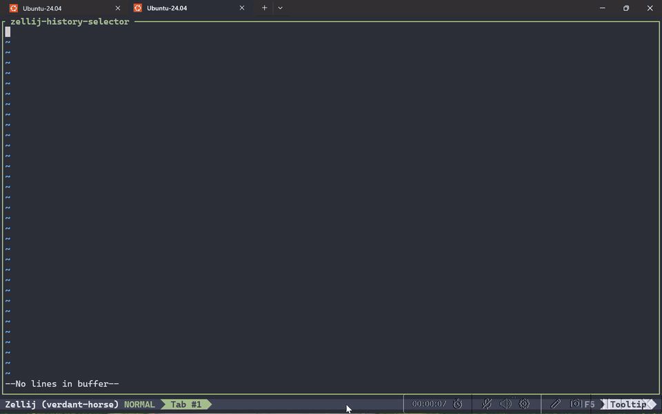

# zellij-history-selector

`zellij-history-selector` is a floating [Zellij](https://github.com/zellij-org/zellij) plugin for searching history and snippets from multiple sources, previewing the selected entry, and inserting it back into the pane you were using before opening the plugin.

It is built for practical workflows:
- shell history
- IPython history
- SQLite-backed local history stores
- clipboard managers such as [CopyQ](https://github.com/hluk/CopyQ)
- custom scripts that export lines or JSON

<p align="center">
  
</p>

## What It Does

- opens in a floating pane
- captures the pane you were on before opening the plugin
- filters entries interactively
- previews multiline entries
- switches between multiple providers
- inserts the selected entry back into the original pane
- can optionally execute the selected entry immediately

## Build

```bash
rustup target add wasm32-wasip1
cargo build --release --target wasm32-wasip1
```

Artifact:

```text
target/wasm32-wasip1/release/zellij-history-selector.wasm
```

Place the built or downloaded plugin at:

```text
~/.config/zellij/plugins/zellij-history-selector.wasm
```

If you do not want to build it yourself, download the `.wasm` release asset from:

<https://github.com/longhongc/zellij-history-selector/releases/tag/v1.3.0>

## Minimal Zellij Setup

Add a plugin alias and a keybind to `~/.config/zellij/config.kdl`.

```kdl
keybinds {
  shared_except "locked" {
    bind "Alt r" {
      LaunchOrFocusPlugin "zellij-history-selector" {
        floating true
      }
    }
  }
}

plugins {
  zellij-history-selector location="file:~/.config/zellij/plugins/zellij-history-selector.wasm" {
    default_mode "insert"
    max_results "500"
    preview_lines "10"
    case_sensitive "false"

    providers "shell"

    provider.shell.type "file_lines"
    provider.shell.name "Shell"
    provider.shell.path "~/.bash_history"
    provider.shell.reverse "true"
    provider.shell.dedupe "true"
    provider.shell.limit "5000"
  }
}
```

Important:
- launch the plugin by alias name: `LaunchOrFocusPlugin "zellij-history-selector"`
- do not launch the raw `file:/.../plugin.wasm` path if you want the `plugins { ... }` config block to apply
- build the `.wasm` yourself or download it, then place it at `~/.config/zellij/plugins/zellij-history-selector.wasm`

Provider config uses a simple namespaced shape:
- `providers "shell,ipython,copyq"`
- `provider.shell.type "file_lines"`
- `provider.ipython.type "ipython"`
- `provider.copyq.type "command_json"`

## Plugin Options

These top-level options control picker behavior:

- `default_mode`
  Default action when selecting an entry.
  Supported values:
  - `insert`: insert the selected text into the target pane
  - `execute`: insert the selected text and execute it
  - `copy`: copy the selected text to the clipboard without inserting it
  Current default: `insert`
- `max_results`
  Maximum number of filtered matches shown in the picker.
  Current default: `500`
- `preview_lines`
  Maximum number of preview lines reserved for the lower preview area.
  Current default: `10`
- `case_sensitive`
  When `true`, search matching becomes case-sensitive.
  Current default: `false`

## Multiple Providers

You can combine multiple providers in one picker by listing them in `providers` and then configuring each one under its own `provider.<id>.*` namespace.

```kdl
providers "shell,ipython,copyq"

provider.shell.type "file_lines"
provider.shell.name "Shell"
provider.shell.path "~/.bash_history"
provider.shell.reverse "true"
provider.shell.dedupe "true"

provider.ipython.type "ipython"
provider.ipython.name "IPython"
provider.ipython.path "~/.ipython/profile_default/history.sqlite"
provider.ipython.dedupe "true"

provider.copyq.type "command_json"
provider.copyq.name "CopyQ"
provider.copyq.command "~/.config/zellij/plugins/zellij-history-selector/scripts/export_copyq_json.py"
provider.copyq.args "clipboard"
provider.copyq.dedupe "true"
```

The order in `providers` is the order used in the UI when switching between sources.

## Provider Types

Use the simplest provider that matches your source:

- `file_lines`
  Best for plain text files with one entry per line.
- `ipython`
  Convenience preset for IPython history.
- `sqlite_query`
  Best for local SQLite-backed history stores.
- `command_lines`
  Best when a command prints one logical entry per line.
- `command_json`
  Best when entries can be multiline or need structured preview.

For `command_json`, each output line must be a JSON object with:
- required: `text`
- optional: `preview`
- optional: `score_hint`

Example:

```json
{"text":"first line\nsecond line","preview":"full item\nwith details","score_hint":42}
```

## Practical Recipes

### Shell History

This recipe is intended for Bash and Zsh history files:
- Bash: `~/.bash_history`
- Zsh: `~/.zsh_history`

```kdl
providers "shell"

provider.shell.type "file_lines"
provider.shell.name "Shell"
provider.shell.path "~/.zsh_history"
provider.shell.reverse "true"
provider.shell.dedupe "true"
provider.shell.limit "5000"
```

For Zsh with `EXTENDED_HISTORY`, the plugin strips the leading `: <epoch>:<duration>;` metadata automatically.

Other shells may use different history formats. If the file is not really one-command-per-line, use a custom exporter with `command_lines` or `command_json` instead of copying this recipe unchanged.

### IPython History

```kdl
providers "ipython"

provider.ipython.type "ipython"
provider.ipython.name "IPython"
provider.ipython.path "~/.ipython/profile_default/history.sqlite"
provider.ipython.limit "5000"
provider.ipython.dedupe "true"
```

### SQLite-Backed Custom History

```kdl
providers "sqlite"

provider.sqlite.type "sqlite_query"
provider.sqlite.name "SQLite History"
provider.sqlite.path "/absolute/path/to/history.sqlite"
provider.sqlite.query "SELECT command, preview, created_at FROM command_history ORDER BY created_at DESC LIMIT 5000"
provider.sqlite.text_column "0"
provider.sqlite.preview_column "1"
provider.sqlite.timestamp_column "2"
provider.sqlite.limit "5000"
provider.sqlite.dedupe "true"
```

### CopyQ

[CopyQ](https://github.com/hluk/CopyQ) works best through `command_json`, so multiline clipboard items stay grouped and render correctly in preview.

The bundled helper applies exporter-side limits before data reaches the plugin runtime:
- defaults to exporting at most 500 items
- truncates oversized items to avoid plugin crashes from huge clipboard payloads

This matters because `provider.limit` is applied after command output reaches the plugin, so it does not protect against a few very large clipboard entries.

With helper script:

```kdl
providers "copyq"

provider.copyq.type "command_json"
provider.copyq.name "CopyQ"
provider.copyq.command "~/.config/zellij/plugins/zellij-history-selector/scripts/export_copyq_json.py"
provider.copyq.args "clipboard"
provider.copyq.limit "5000"
provider.copyq.dedupe "true"
```

Optional tighter helper limits:

```kdl
provider.copyq.args "clipboard --max-items 200 --max-chars 8000"
```

If you want a clipboard-only picker, set:

```kdl
default_mode "copy"
```

Directly through `copyq eval`:

```kdl
providers "copyq"

provider.copyq.type "command_json"
provider.copyq.name "CopyQ Direct"
provider.copyq.command "copyq"
provider.copyq.args "eval -- \"tab('clipboard'); for (var i = size(); i > 0; --i) { var item = str(read(i - 1)); if (item.length) print(JSON.stringify({text: item, preview: item, score_hint: i}) + '\\n'); }\""
provider.copyq.limit "5000"
provider.copyq.dedupe "true"
```

The direct `copyq eval` form is more compact, but the helper script is safer for real-world clipboard histories because it can cap exported rows and item size before the plugin sees the payload.

## Custom Integrations

If a tool is easy to export, you usually do not need a built-in provider for it:

- use `file_lines` if the tool already writes a line-based file
- use `sqlite_query` if the data is already in SQLite
- use `command_lines` if a command can print one entry per line
- use `command_json` if entries are multiline or need structured preview

For tools that are hard to parse, write a small exporter script first. A practical location is:

```text
~/.config/zellij/plugins/zellij-history-selector/scripts/
```

If you want repo-local demo providers and ready-to-use testing fixtures, see [scripts/README.md](scripts/README.md).

## Related Projects

- [Zellij](https://github.com/zellij-org/zellij)
- [CopyQ](https://github.com/hluk/CopyQ)
- [IPython](https://github.com/ipython/ipython)
